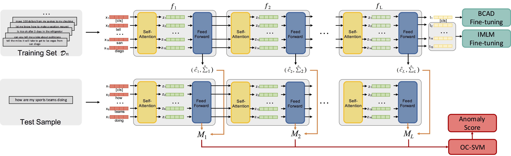

## Requirements

* Python 3.7.3
* PyTorch 1.2
* Transformers 2.7.0
* simpletransformers 0.22.1

## Overview


## To run the models
Use the command 
```
python ood_main.py \
  --method MDF \
  --data_type courses \
  --model_class bert
```

To run baselines, change MDF to one from ``single_layer_bert``, ``tf-idf`` and ``MSP`` (should load a BCAD mdoel). 


## Fine-tuning BERT with BCAD and IMLM

### In-domain Masked Language Model (IMLM)
```
python finetune_bert.py \
    --type finetune_imlm \ 
    --data_type courses \ 
    --model_class bert
```

### Binary   classification   with   auxiliary   dataset (BCAD)
```
python finetune_bert.py \
    --type finetune_binary \ 
    --data_type courses \ 
    --model_class bert
    --load_path xxx
```
